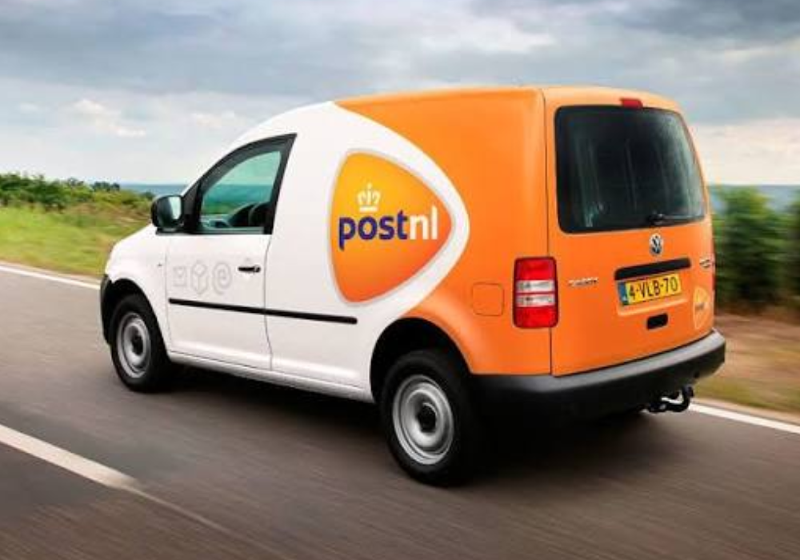

# Welcome

Your mail and parcels together in Homey. View expected mail, follow deliveries and let Homey react when something changes.

## Start here

* [Install and connect](installation.md)
* [Widgets](widgets/)
* [Flow cards](flows.md)
* [Troubleshooting](troubleshooting.md)

[Homey App Store](https://homey.app/nl-nl/app/nl.lrvdlinden.postnl/PostNL/) · [Community](https://community.homey.app/t/app-pro-postnl-for-homey/159674)
