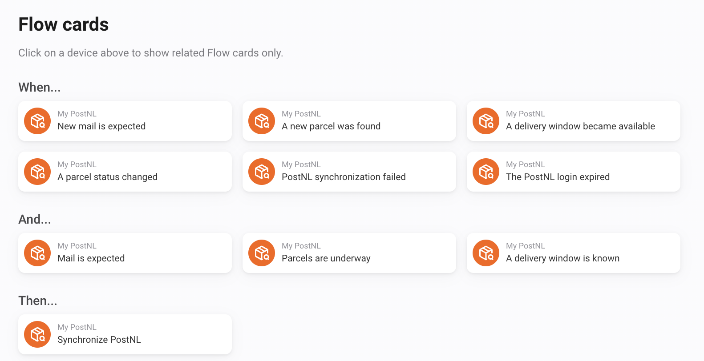

# Flow tokens

Tokens belong to a trigger. An empty field means information is unavailable. Image tokens work with Homey actions that support images. Check the associated availability value first.

Overview of the PostNL Flow cards. The tokens for each trigger are described below.

## New mail is expected

| Token | Meaning | Type |
| --- | --- | --- |
| `count` | Number of mail items | number |
| `id` | Mail item ID | string |
| `title` | Mail item | string |
| `sender` | Sender (if available) | string |
| `date` | Delivery date | string |
| `unread` | Unread | boolean |
| `image_available` | Image available | boolean |
| `image` | Mail item image | image |

## A new parcel was found

| Token | Meaning | Type |
| --- | --- | --- |
| `id` | Shipment ID | string |
| `sender` | Sender | string |
| `receiver` | Receiver | string |
| `title` | Parcel | string |
| `barcode` | Barcode | string |
| `status` | Status | string |
| `status_raw` | Official PostNL status | string |
| `status_code` | Official PostNL status code | string |
| `status_event` | Latest PostNL event | string |
| `status_event_time` | Latest status update | string |
| `delivery_date` | Delivery date | string |
| `delivery_window` | Delivery window | string |
| `delivery_window_from` | Delivery window from | string |
| `delivery_window_to` | Delivery window to | string |
| `delivery_window_type` | Delivery window type | string |
| `details_url` | Tracking URL | string |
| `shipment_type` | Shipment type | string |
| `delivery_address_type` | Delivery address type | string |
| `direction` | Direction | string |
| `created_at` | Created at | string |
| `delivered` | Delivered | boolean |
| `shared_from` | Shared from | string |
| `source_account_id` | Source account ID | string |
| `package_status_text` | Package status | string |
| `package_window_text` | Delivery window text | string |
| `package_delivery_date` | Package delivery date | string |
| `package_sender` | Package sender | string |
| `package_tracking` | Package tracking number | string |
| `package_image_available` | My delivery image available | boolean |
| `package_image` | My delivery image | image |
| `weight` | Weight | string |
| `dimensions` | Dimensions | string |

## A delivery window became available

| Token | Meaning | Type |
| --- | --- | --- |
| `id` | Shipment ID | string |
| `sender` | Sender | string |
| `receiver` | Receiver | string |
| `title` | Parcel | string |
| `barcode` | Barcode | string |
| `status` | Status | string |
| `status_raw` | Official PostNL status | string |
| `status_code` | Official PostNL status code | string |
| `status_event` | Latest PostNL event | string |
| `status_event_time` | Latest status update | string |
| `delivery_date` | Delivery date | string |
| `delivery_window` | Delivery window | string |
| `delivery_window_from` | Delivery window from | string |
| `delivery_window_to` | Delivery window to | string |
| `delivery_window_type` | Delivery window type | string |
| `details_url` | Tracking URL | string |
| `shipment_type` | Shipment type | string |
| `delivery_address_type` | Delivery address type | string |
| `direction` | Direction | string |
| `created_at` | Created at | string |
| `delivered` | Delivered | boolean |
| `shared_from` | Shared from | string |
| `source_account_id` | Source account ID | string |
| `package_status_text` | Package status | string |
| `package_window_text` | Delivery window text | string |
| `package_delivery_date` | Package delivery date | string |
| `package_sender` | Package sender | string |
| `package_tracking` | Package tracking number | string |
| `package_image_available` | My delivery image available | boolean |
| `package_image` | My delivery image | image |
| `weight` | Weight | string |
| `dimensions` | Dimensions | string |

## A parcel status changed

| Token | Meaning | Type |
| --- | --- | --- |
| `old_status` | Previous status | string |
| `id` | Shipment ID | string |
| `sender` | Sender | string |
| `receiver` | Receiver | string |
| `title` | Parcel | string |
| `barcode` | Barcode | string |
| `status` | Status | string |
| `status_raw` | Official PostNL status | string |
| `status_code` | Official PostNL status code | string |
| `status_event` | Latest PostNL event | string |
| `status_event_time` | Latest status update | string |
| `delivery_date` | Delivery date | string |
| `delivery_window` | Delivery window | string |
| `delivery_window_from` | Delivery window from | string |
| `delivery_window_to` | Delivery window to | string |
| `delivery_window_type` | Delivery window type | string |
| `details_url` | Tracking URL | string |
| `shipment_type` | Shipment type | string |
| `delivery_address_type` | Delivery address type | string |
| `direction` | Direction | string |
| `created_at` | Created at | string |
| `delivered` | Delivered | boolean |
| `shared_from` | Shared from | string |
| `source_account_id` | Source account ID | string |
| `package_status_text` | Package status | string |
| `package_window_text` | Delivery window text | string |
| `package_delivery_date` | Package delivery date | string |
| `package_sender` | Package sender | string |
| `package_tracking` | Package tracking number | string |
| `package_image_available` | My delivery image available | boolean |
| `package_image` | My delivery image | image |
| `weight` | Weight | string |
| `dimensions` | Dimensions | string |

## PostNL synchronization failed

| Token | Meaning | Type |
| --- | --- | --- |
| `error` | Error | string |

## The PostNL login expired

This card has no custom tokens.

## Status and images

`status_raw` contains the official status available from PostNL, with a fallback when absent. `status_code` is the separate status code and can be empty. `status_event` and `status_event_time` describe the latest event.

`package_status_text`, `package_window_text`, `package_delivery_date`, `package_sender` and `package_tracking` provide matching delivery-notification data. `package_image` is a generated My Delivery overview; `image` on the new-mail trigger is the available mail scan. Parcel dates use DD-MM-YYYY formatting.
