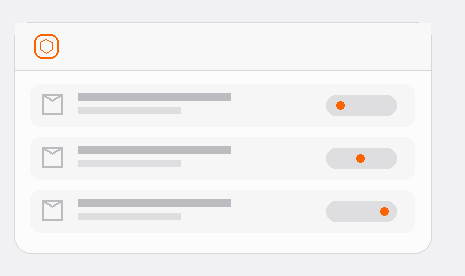
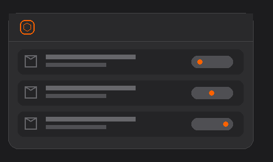

# My Packages

View the parcel list and open a parcel for details. Available information may include status, sender, delivery date and delivery window. Missing information can only appear when PostNL supplies it.

Select the correct My PostNL device when adding the widget. See [Troubleshooting](../troubleshooting.md) if data is missing.
