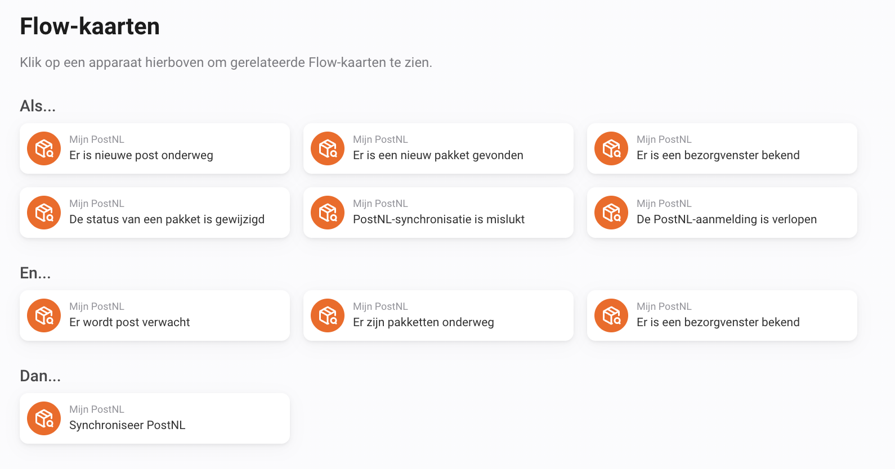

# Flow-tokens

Tokens zijn gekoppeld aan een trigger. Een leeg veld betekent dat de informatie niet beschikbaar is. Afbeeldingstokens werken met Homey-acties die afbeeldingen ondersteunen. Controleer eerst de bijbehorende beschikbaarheidswaarde.

Overzicht van de PostNL Flow-kaarten. De tokens per trigger worden hieronder beschreven.

## Er is nieuwe post onderweg

| Token             | Betekenis                     | Type    |
| ----------------- | ----------------------------- | ------- |
| `count`           | Aantal poststukken            | number  |
| `id`              | Poststuk-ID                   | string  |
| `title`           | Poststuk                      | string  |
| `sender`          | Afzender (indien beschikbaar) | string  |
| `date`            | Bezorgdatum                   | string  |
| `unread`          | Ongelezen                     | boolean |
| `image_available` | Afbeelding beschikbaar        | boolean |
| `image`           | Afbeelding poststuk           | image   |

## Er is een nieuw pakket gevonden

| Token                     | Betekenis                             | Type    |
| ------------------------- | ------------------------------------- | ------- |
| `id`                      | Zending-ID                            | string  |
| `sender`                  | Afzender                              | string  |
| `receiver`                | Ontvanger                             | string  |
| `title`                   | Pakket                                | string  |
| `barcode`                 | Barcode                               | string  |
| `status`                  | Status                                | string  |
| `status_raw`              | Officiële PostNL-status               | string  |
| `status_code`             | Officiële PostNL-statuscode           | string  |
| `status_event`            | Laatste PostNL-gebeurtenis            | string  |
| `status_event_time`       | Laatste statusupdate                  | string  |
| `delivery_date`           | Bezorgdatum                           | string  |
| `delivery_window`         | Bezorgvenster                         | string  |
| `delivery_window_from`    | Bezorgvenster vanaf                   | string  |
| `delivery_window_to`      | Bezorgvenster tot                     | string  |
| `delivery_window_type`    | Type bezorgvenster                    | string  |
| `details_url`             | Tracking-URL                          | string  |
| `shipment_type`           | Zendingstype                          | string  |
| `delivery_address_type`   | Type bezorgadres                      | string  |
| `direction`               | Richting                              | string  |
| `created_at`              | Aangemaakt op                         | string  |
| `delivered`               | Bezorgd                               | boolean |
| `shared_from`             | Gedeeld via                           | string  |
| `source_account_id`       | Bronaccount-ID                        | string  |
| `package_status_text`     | Pakketstatus                          | string  |
| `package_window_text`     | Tekst bezorgvenster                   | string  |
| `package_delivery_date`   | Bezorgdatum pakket                    | string  |
| `package_sender`          | Afzender pakket                       | string  |
| `package_tracking`        | Trackingnummer pakket                 | string  |
| `package_image_available` | Afbeelding Mijn Bezorging beschikbaar | boolean |
| `package_image`           | Afbeelding Mijn Bezorging             | image   |
| `weight`                  | Gewicht                               | string  |
| `dimensions`              | Afmetingen                            | string  |

## Er is een bezorgvenster bekend

| Token                     | Betekenis                             | Type    |
| ------------------------- | ------------------------------------- | ------- |
| `id`                      | Zending-ID                            | string  |
| `sender`                  | Afzender                              | string  |
| `receiver`                | Ontvanger                             | string  |
| `title`                   | Pakket                                | string  |
| `barcode`                 | Barcode                               | string  |
| `status`                  | Status                                | string  |
| `status_raw`              | Officiële PostNL-status               | string  |
| `status_code`             | Officiële PostNL-statuscode           | string  |
| `status_event`            | Laatste PostNL-gebeurtenis            | string  |
| `status_event_time`       | Laatste statusupdate                  | string  |
| `delivery_date`           | Bezorgdatum                           | string  |
| `delivery_window`         | Bezorgvenster                         | string  |
| `delivery_window_from`    | Bezorgvenster vanaf                   | string  |
| `delivery_window_to`      | Bezorgvenster tot                     | string  |
| `delivery_window_type`    | Type bezorgvenster                    | string  |
| `details_url`             | Tracking-URL                          | string  |
| `shipment_type`           | Zendingstype                          | string  |
| `delivery_address_type`   | Type bezorgadres                      | string  |
| `direction`               | Richting                              | string  |
| `created_at`              | Aangemaakt op                         | string  |
| `delivered`               | Bezorgd                               | boolean |
| `shared_from`             | Gedeeld via                           | string  |
| `source_account_id`       | Bronaccount-ID                        | string  |
| `package_status_text`     | Pakketstatus                          | string  |
| `package_window_text`     | Tekst bezorgvenster                   | string  |
| `package_delivery_date`   | Bezorgdatum pakket                    | string  |
| `package_sender`          | Afzender pakket                       | string  |
| `package_tracking`        | Trackingnummer pakket                 | string  |
| `package_image_available` | Afbeelding Mijn Bezorging beschikbaar | boolean |
| `package_image`           | Afbeelding Mijn Bezorging             | image   |
| `weight`                  | Gewicht                               | string  |
| `dimensions`              | Afmetingen                            | string  |

## De status van een pakket is gewijzigd

| Token                     | Betekenis                             | Type    |
| ------------------------- | ------------------------------------- | ------- |
| `old_status`              | Vorige status                         | string  |
| `id`                      | Zending-ID                            | string  |
| `sender`                  | Afzender                              | string  |
| `receiver`                | Ontvanger                             | string  |
| `title`                   | Pakket                                | string  |
| `barcode`                 | Barcode                               | string  |
| `status`                  | Status                                | string  |
| `status_raw`              | Officiële PostNL-status               | string  |
| `status_code`             | Officiële PostNL-statuscode           | string  |
| `status_event`            | Laatste PostNL-gebeurtenis            | string  |
| `status_event_time`       | Laatste statusupdate                  | string  |
| `delivery_date`           | Bezorgdatum                           | string  |
| `delivery_window`         | Bezorgvenster                         | string  |
| `delivery_window_from`    | Bezorgvenster vanaf                   | string  |
| `delivery_window_to`      | Bezorgvenster tot                     | string  |
| `delivery_window_type`    | Type bezorgvenster                    | string  |
| `details_url`             | Tracking-URL                          | string  |
| `shipment_type`           | Zendingstype                          | string  |
| `delivery_address_type`   | Type bezorgadres                      | string  |
| `direction`               | Richting                              | string  |
| `created_at`              | Aangemaakt op                         | string  |
| `delivered`               | Bezorgd                               | boolean |
| `shared_from`             | Gedeeld via                           | string  |
| `source_account_id`       | Bronaccount-ID                        | string  |
| `package_status_text`     | Pakketstatus                          | string  |
| `package_window_text`     | Tekst bezorgvenster                   | string  |
| `package_delivery_date`   | Bezorgdatum pakket                    | string  |
| `package_sender`          | Afzender pakket                       | string  |
| `package_tracking`        | Trackingnummer pakket                 | string  |
| `package_image_available` | Afbeelding Mijn Bezorging beschikbaar | boolean |
| `package_image`           | Afbeelding Mijn Bezorging             | image   |
| `weight`                  | Gewicht                               | string  |
| `dimensions`              | Afmetingen                            | string  |

## PostNL-synchronisatie is mislukt

| Token   | Betekenis   | Type   |
| ------- | ----------- | ------ |
| `error` | Foutmelding | string |

## De PostNL-aanmelding is verlopen

Deze kaart heeft geen eigen tokens.

## Status en afbeeldingen

`status_raw` bevat de officiële status zoals beschikbaar uit PostNL, met een terugvalwaarde wanneer die ontbreekt. `status_code` is de afzonderlijke statuscode en kan leeg zijn. `status_event` en `status_event_time` beschrijven de laatste gebeurtenis.

`package_status_text`, `package_window_text`, `package_delivery_date`, `package_sender` en `package_tracking` bieden de overeenkomstige gegevens voor bezorgmeldingen. `package_image` is een gegenereerd Mijn Bezorging-overzicht; `image` bij nieuwe post is de beschikbare postscan. Pakketdatums worden als DD-MM-JJJJ geformatteerd.
