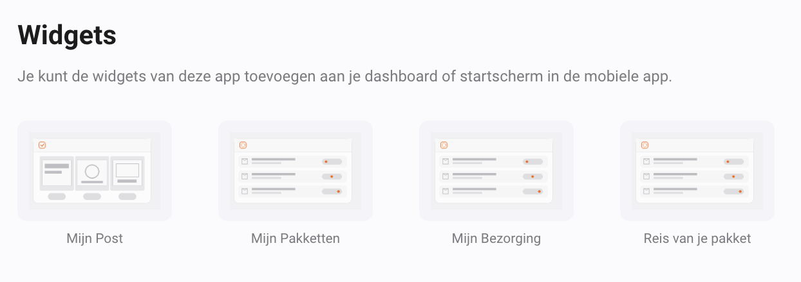

# Widgets

Voeg op je Homey-dashboard een PostNL-widget toe en selecteer het gewenste Mijn PostNL-apparaat. Iedere widget gebruikt één geselecteerd account. De previews hieronder zijn illustraties uit de app; je eigen gegevens kunnen afwijken.

- [Mijn Post](widgets/mijn-post.md)
- [Mijn Pakketten](widgets/mijn-pakket.md)
- [Mijn Bezorging](widgets/pakket-details.md)
- [Reis van je pakket](widgets/pakket-reis.md)
